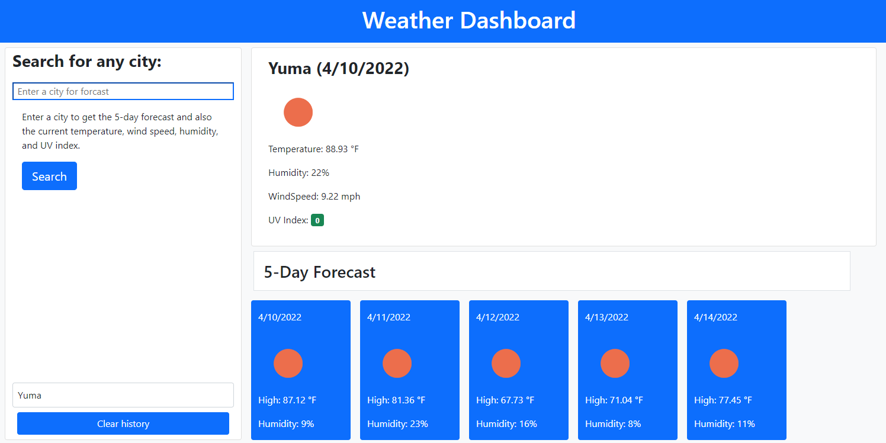

# weather_dashboard
This is an application where the weather for any city can be accessed. 

## URL: https://caleeeb.github.io/weather-dashboard/


## Description
An application that when a user enters a city, they are given the current weather and a five-day forecast. 

## User Story
```
AS A traveler
I WANT to see the weather outlook for multiple cities
SO THAT I can plan a trip accordingly
```

## Acceptance Criteria
```
GIVEN a weather dashboard with form inputs
WHEN I search for a city
THEN I am presented with current and future conditions for that city and that city is added to the search history
WHEN I view current weather conditions for that city
THEN I am presented with the city name, the date, an icon representation of weather conditions, the temperature, the humidity, the wind speed, and the UV index
WHEN I view the UV index
THEN I am presented with a color that indicates whether the conditions are favorable, moderate, or severe
WHEN I view future weather conditions for that city
THEN I am presented with a 5-day forecast that displays the date, an icon representation of weather conditions, the temperature, the wind speed, and the humidity
WHEN I click on a city in the search history
THEN I am again presented with current and future conditions for that city 
```

## Screenshot


## API's Used
<p><a href="https://openweathermap.org/api/one-call-api">Open Weather: One Call API 1.0></a></p>
<p><a href="https://openweathermap.org/current">Open Weather: Current Weather Data API></a></p>
<p><a href="https://getbootstrap.com/">Bootstrap CSS Framework></a></p>

